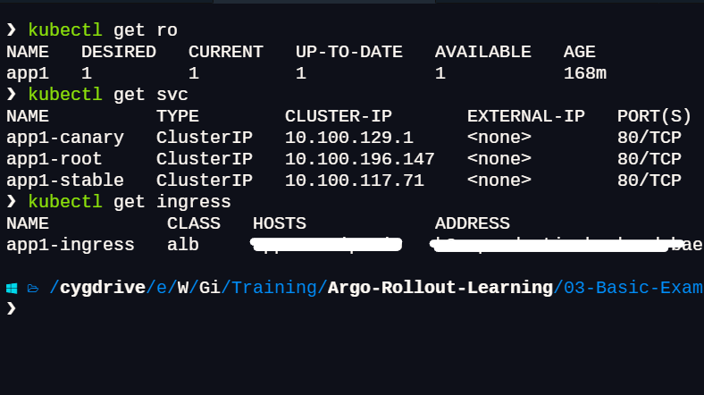
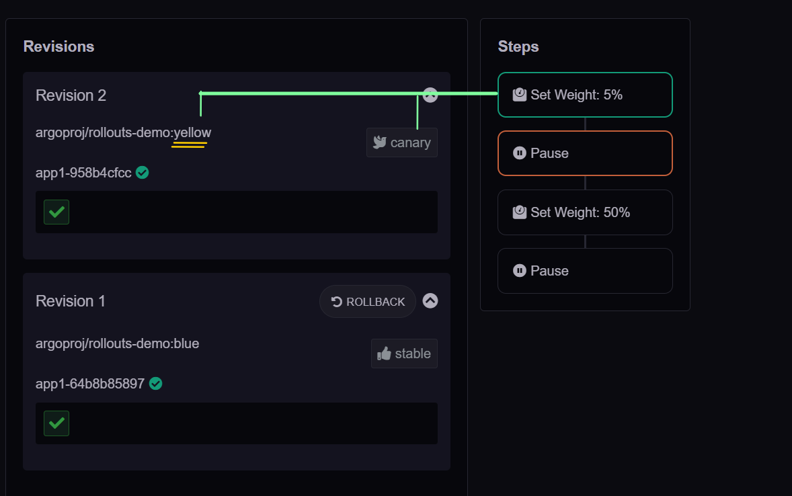
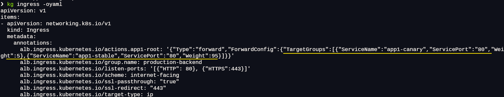
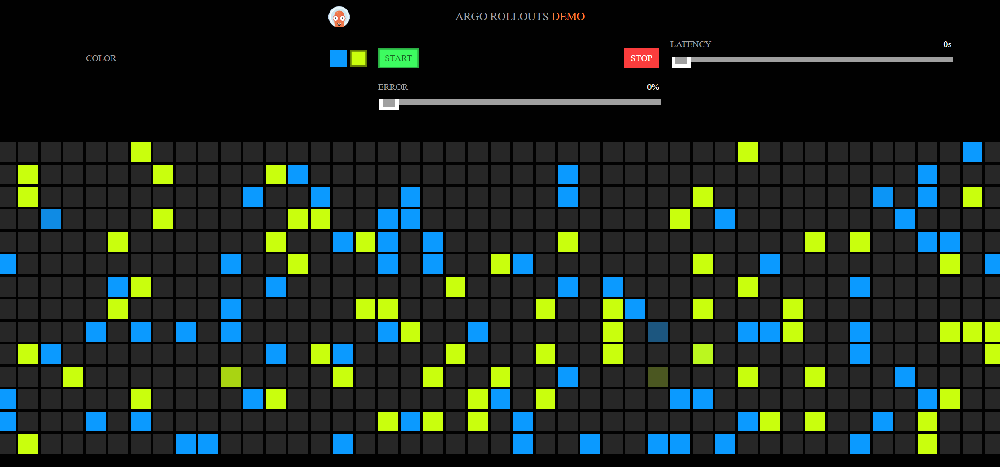
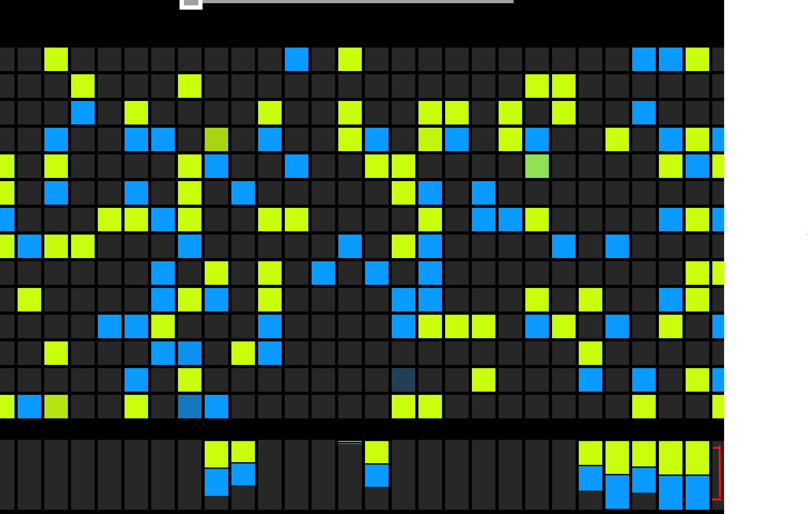
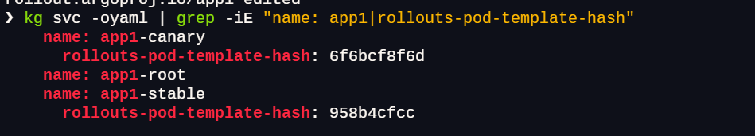
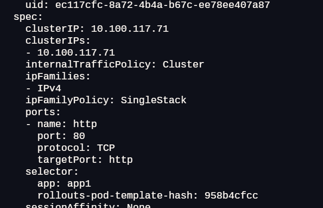

## ALB Ingress

1. Use the manifest from argocd github repo for creating

   - A Rollout
   - Three Services (root, stable, canary)
   - An Ingress

   ```bash
   kubectl apply -f https://raw.githubusercontent.com/argoproj/argo-rollouts/master/docs/getting-started/alb/rollout.yaml
   kubectl apply -f https://raw.githubusercontent.com/argoproj/argo-rollouts/master/docs/getting-started/alb/services.yaml
   kubectl apply -f https://raw.githubusercontent.com/argoproj/argo-rollouts/master/docs/getting-started/alb/ingress.yaml

   ```

2. Or download it on local and update it according to need
   
   ```bash
   cd 03-Basic-Examples/configs/02-ALB
   kubectl apply -f rollout.yaml
   kubectl apply -f ingress.yaml
   kubectl apply -f services.yaml
   ```

3. After applying the manifests you should see the following rollout, services, and ingress resources in the cluster:
   
   ```bash
   kubectl get ro
   kubectl get svc
   kubectl get ingress
   kubectl argo rollouts get rollout app1
   ```
   

4. Perform an update
  
   ```bash
   kubectl argo rollouts set image app1 app1=argoproj/rollouts-demo:yellow
   kubectl argo rollouts get rollout app1
   ```
    

   - At this point, both the canary and stable version of the Rollout are running, with 5% of the traffic directed to the canary.  
  
     
   
   - To understand how this works, inspect the listener rules for the ALB. 
     
   - When looking at the listener rules, we see that the forward action weights have been modified by the controller to reflect the current weight of the canary.

     

     ```json
      alb.ingress.kubernetes.io/actions.app1-root: '{"Type":"forward","ForwardConfig": { "TargetGroups":[
         {"ServiceName":"app1-canary","ServicePort":"80","Weight":5},
         {"ServiceName":"app1-stable","ServicePort":"80","Weight":95}
         ]}}'
     ```

   - Also you can see the application in UI  - new yellow version is displayed less than blue

     
   
   - Now promote the application , so as per configuration 50% traffic will go to new version.
     
     ```bash
     kubectl argo rollouts promote app1
     ```
    
     

---------------------------------------

- The controller has added rollouts-pod-template-hash selector to the Services and attached the same label to the Pods.  
   Therefore, you can split the traffic by simply forwarding the requests to the Services according to the weights.
   
    
    
    


---------------------------------------

## CleanUp:

```bash
kubectl delete ro app1
kubectl delete ingress app1-ingress
kubectl delete svc app1-root app1-stable app1-canary
```

---------------------------------------