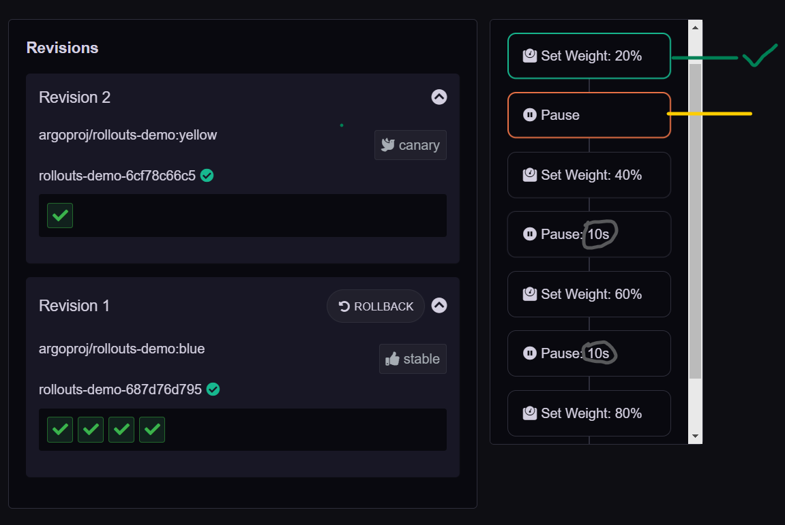

## Kubectl Basic Rollout Example

### Create Rollout of blue version

   1. Apply the file which available on Argo-Rollout Git repo
   
       ```bash
       $ kubectl apply -f https://raw.githubusercontent.com/argoproj/argo-rollouts/master/docs/getting-started/basic/rollout.yaml
   
       $ kubectl apply -f https://raw.githubusercontent.com/argoproj/argo-rollouts/master/docs/getting-started/basic/service.yaml
   
       ```
   
   2. Or if you want you can download the file do some modification and apply it
      
      - [rollout.yaml](./configs/01-basic/rollout.yaml)
   
      - [svc.yaml](./configs/01-basic/svc.yaml)
   
      ```bash
      cd 03-Basic-Examples/config/01-basic
      kubectl apply -f rollout.yaml
      kubectl apply -f svc.yaml
      ```
      
   3. Initial creations of any Rollout will immediately scale up the replicas to 100% (skipping any canary upgrade steps, analysis, etc...) since there was no upgrade that occurred.
      
      ```bash
      # To watch the rollout as it deploys
      $ kubectl argo rollouts get rollout rollouts-demo --watch
      ```
        
   
   4. See the UI 
      
      ```bash
      kubectl  port-forward svc/rollouts-demo 8080:80
      ```
      

--------------------------------------------------

### Updating a Rollout with new version
  
  - Updating a Rollout involves modifying the rollout spec, typically changing the container image field with a new version, and then running kubectl apply against the new manifest.

     ```yaml
    spec:
      containers:
      - name: rollouts-demo
        image: argoproj/rollouts-demo:yellow
     ``` 

  - As a convenience, the rollouts plugin provides a set image command, which performs these steps against the live rollout object in-place.
    
    ```bash
    $ kubectl argo rollouts set image rollouts-demo rollouts-demo=argoproj/rollouts-demo:yellow
    ```
  
  - See the Rollout status
    
    ```bash
    $ kubectl argo rollouts get rollout rollouts-demo --watch
    ```

    

---------------------------------------------------

### Promoting a Rollout (after pause)
 
   - The rollout is now in a **paused** state.  
   
   - When a Rollout reaches a pause step `with no duration`, it will remain in a paused state indefinitely `until it is resumed/promoted`

   - Promot using CLI
     
     ```bash
     $ kubectl argo rollouts promote rollouts-demo
     ```
   - You can also use the argo rollout UI to promote
     
     

     
   
   - So now once we promote new version will be promoted 60% replicas. 

   - After that it will pause for 10 sec and weight will be set to the 80%
     
   - Again it will pause for 10 sec and go with 100% promotion
      
       

---------------------------------------------------

### Full Promotion

  - Once all steps complete successfully, the new ReplicaSet is marked as the "stable" ReplicaSet.

    


---------------------------------------------------

### Again update the spec say with red version
  
  ```yaml
  spec:
    replicas: 5
    strategy:
      canary:
        steps:
        - setWeight: 60
        - pause: {}
        - setWeight: 80
        - pause: {duration: 300}
  template:
    spec:
      containers:
      - name: rollouts-demo
        image: argoproj/rollouts-demo:red
  ```

  ```bash
  cd 03-Basic-Examples/config/01-basic
  kubectl apply -f rollout-red-version.yaml
  kubectl argo rollouts get rollout rollouts-demo
  kubectl argo rollouts promote rollouts-demo
  kubectl argo rollouts get rollout rollouts-demo
  ```

   
   

---------------------------------------------------

### Cleanup
  
  ```bash
  kubectl delete rollouts rollouts-demo
  kubectl delete svc rollouts-demo
  ```

---------------------------------------------------

### Summary

- The Rollout in this basic example did not utilize a ingress controller or service mesh provider to route traffic.   

- Instead, it used normal Kubernetes Service networking (i.e. kube-proxy) to achieve an approximate canary weight, based on the closest ratio of new to old replica counts.   

- As a result, this Rollout had a limitation in that it could only achieve a minimum canary weight of 20%, by scaling 1 of 5 pods to run the new version.   

- In order to achieve much finer grained canaries, an ingress controller or service mesh is necessary.


---------------------------------------------------