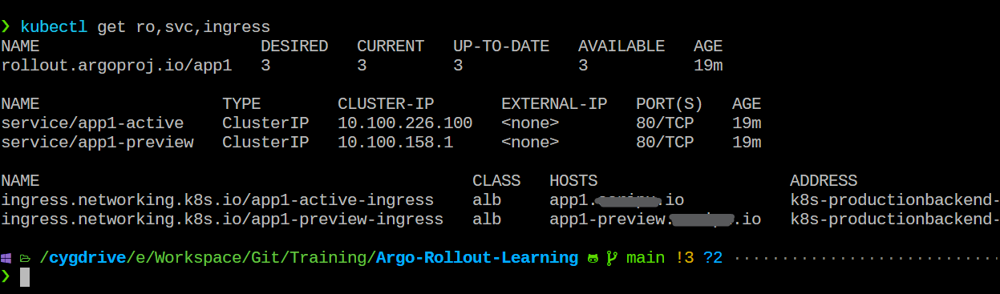
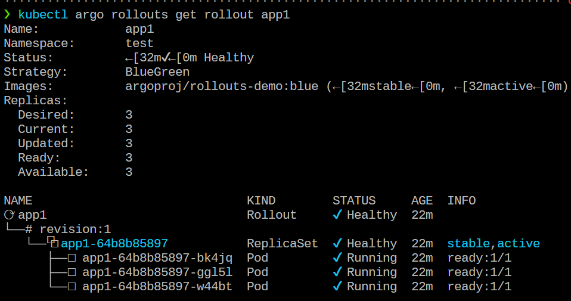
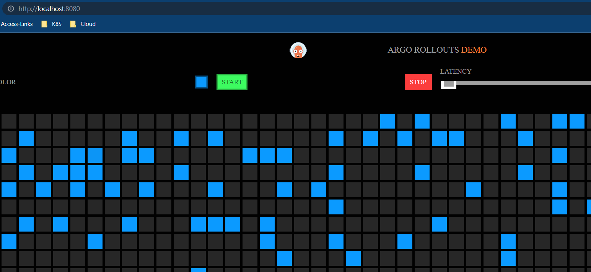
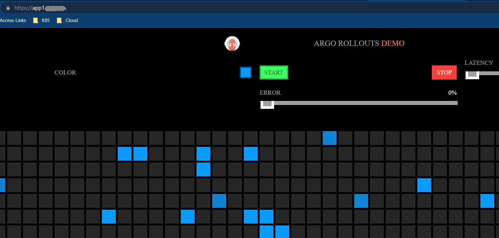
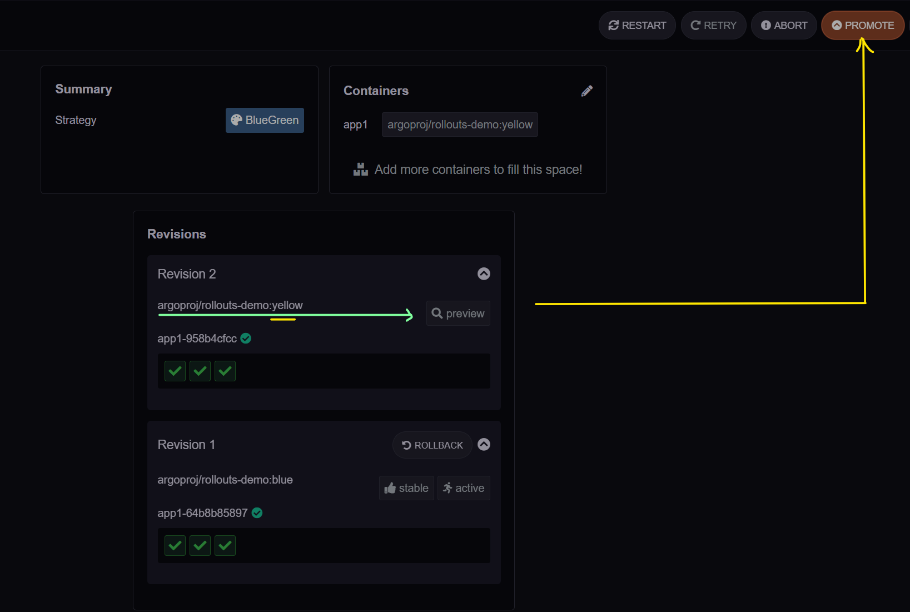
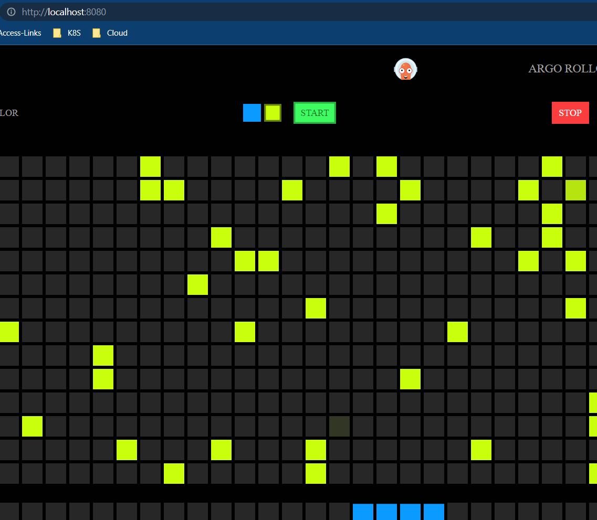
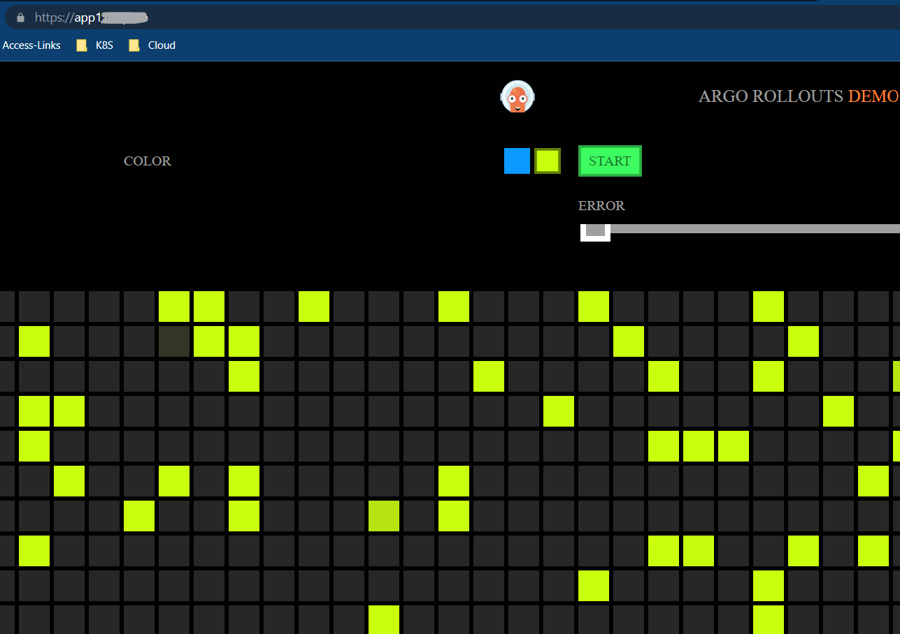
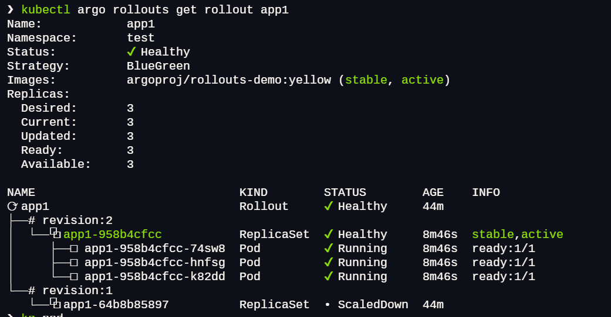
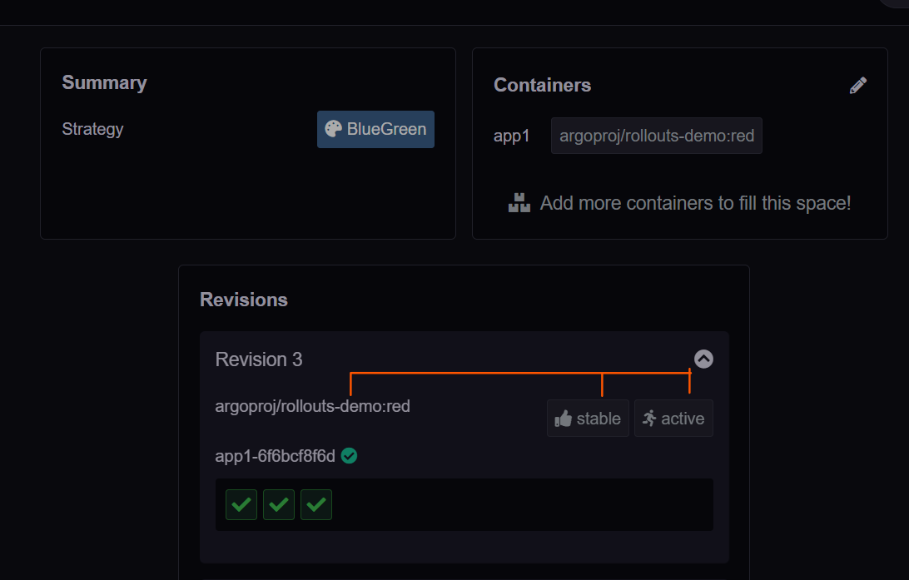
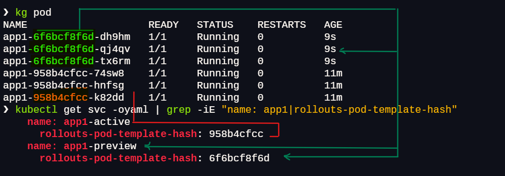

## ALB Ingress

1. Apply the Files (update the ingress as per your environment)
   
   ```bash
   cd 03-Basic-Examples/configs/02-ALB
   kubectl apply -f rollout.yaml
   kubectl apply -f active-ingress.yaml
   kubectl apply -f preview-ingress.yaml
   kubectl apply -f services.yaml
   ```

   - A Rollout
   - Two Services (stable, canary)
   - Two Ingresses
   
   -------------------
   
2. After applying the manifests you should see the following rollout, services, and ingress resources in the cluster:
   
   ```bash
   kubectl get ro
   kubectl get svc
   kubectl get ingress
   ```
   
   
   ```bash
   $ kubectl argo rollouts get rollout app1
   ```

   

   -------------------

3. Perform an update
   
  - First check the UI either by using domain or port-forwding the service

     ```bash
     kubectl port-forward svc/app1-active 8080:80
     curl http://app1.mydomain.io
     curl http://localhost:8080
     ```

    
    
    
   
 
  - Now Update the app with new version (yellow color)
   
     ```bash
     kubectl argo rollouts set image app1 app1=argoproj/rollouts-demo:yellow
     ```
  
    

     ```bash
     kubectl port-forward svc/app1-active 8080:80
     curl http://app1.mydomain.io
     curl http://localhost:8080
     ```

    
    
    


  - Rollout Status    

     ```bash
     kubectl argo rollouts get rollout app1
     ```

    
  
  - Upgrade the to red and see it in Argo rollout UI
   
    
    

---------------------------------------


- The controller has added rollouts-pod-template-hash selector to the Services and attached the same label to the Pods.  
   Therefore, you can split the traffic by simply forwarding the requests to the Services according to the weights.
    
    ```bash
    $ kubectl argo rollouts set image app1 app1=argoproj/rollouts-demo:red
    $ kubectl get svc -oyaml | grep -iE "name: app1|rollouts-pod-template-hash"
    ```
    
    

    
    

    